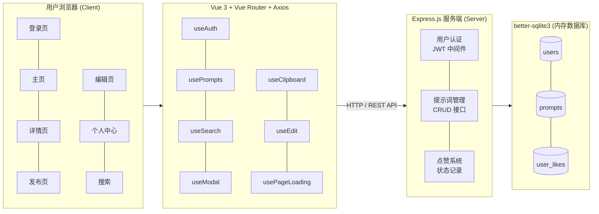
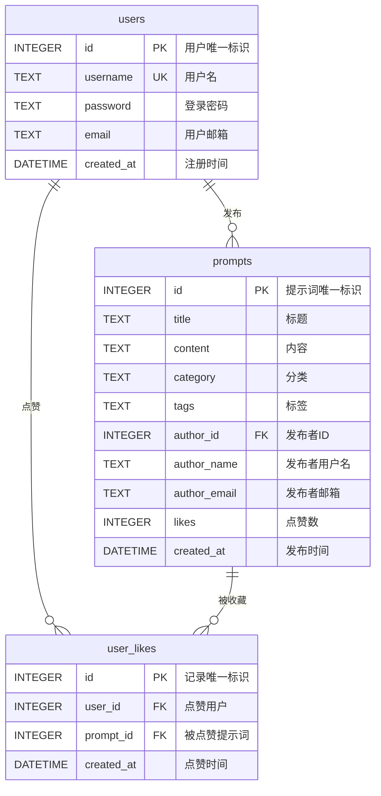

# 第3章 系统设计

## 3.1 架构图设计

PromptCraft 采用前后端分离的 B/S 架构，总体模块图如下：




### 模块说明

**前端模块：**

| 模块 | 功能说明 |
|------|---------|
| 登录页 | 用户名密码登录，JWT Token 认证 |
| 主页 | 提示词卡片列表、分类筛选、搜索联想 |
| 详情页 | 提示词完整内容、一键复制、点赞、编辑/删除 |
| 发布页 | 表单提交新提示词，实时校验 |
| 编辑页 | 修改已有提示词内容 |
| 个人中心 | 我的提示词、邮箱脱敏显示/隐藏 |

**后端模块：**

| 模块 | 功能说明 |
|------|---------|
| 用户认证 | JWT 令牌签发与验证、登录接口 |
| 提示词管理 | CRUD 接口、搜索（含 SQL 注入演示） |
| 点赞系统 | 点赞/取消点赞、状态查询 |

## 3.2 数据库设计

本系统共设计 3 张数据表，如下所示：

**表3-1 users表**

| 字段 | 数据类型 | 是否为主键 | 备注 |
|------|---------|-----------|------|
| id | INTEGER | 是，自增 | 用户的唯一标识 |
| username | TEXT | 否，唯一 | 用户名 |
| password | TEXT | 否 | 用户密码 |
| email | TEXT | 否 | 用户邮箱 |
| created_at | DATETIME | 否 | 注册时间，默认当前时间 |

**表3-2 prompts表**

| 字段 | 数据类型 | 是否为主键 | 备注 |
|------|---------|-----------|------|
| id | INTEGER | 是，自增 | 提示词的唯一标识 |
| title | TEXT | 否 | 提示词标题 |
| content | TEXT | 否 | 提示词内容 |
| category | TEXT | 否 | 分类（写作/编程/绘画/翻译/其他） |
| tags | TEXT | 否 | 标签，逗号分隔 |
| author_id | INTEGER | 否 | 关联users表id，外键 |
| author_name | TEXT | 否 | 作者用户名（冗余存储） |
| author_email | TEXT | 否 | 作者邮箱（冗余存储） |
| likes | INTEGER | 否 | 点赞数，默认0 |
| created_at | DATETIME | 否 | 发布时间，默认当前时间 |

**表3-3 user_likes表**

| 字段 | 数据类型 | 是否为主键 | 备注 |
|------|---------|-----------|------|
| id | INTEGER | 是，自增 | 点赞记录的唯一标识 |
| user_id | INTEGER | 否 | 关联users表id，外键 |
| prompt_id | INTEGER | 否 | 关联prompts表id，外键 |
| created_at | DATETIME | 否 | 点赞时间，默认当前时间 |

> 注：user_id 和 prompt_id 设有 UNIQUE 联合约束，防止重复点赞。

## 3.3 E-R 图设计

### 3.3.1 实体属性图

```
                          ┌─────────────────────┐
                          │       users         │
                          ├─────────────────────┤
                     ┌────│ *id (PK)            │
                     │    │  username           │
                     │    │  password           │
                     │    │  email              │
                     │    │  created_at         │
                     │    └─────────────────────┘
                     │              │
                     │              │ 1
                     │              │
                     │         ┌────┴────┐
                     │         │  发布    │
                     │         │ (发布者) │
                     │         └────┬────┘
                     │              │ N
                     │              │
                     │    ┌─────────────────────┐
                     │    │      prompts        │
                     │    ├─────────────────────┤
                     │    │ *id (PK)            │
                     │    │  title              │
                     │    │  content            │
                     │    │  category           │
                     │    │  tags               │
                     │    │  author_id (FK)     │──────┘
                     │    │  author_name        │
                     │    │  author_email       │
                     │    │  likes              │
                     │    │  created_at         │
                     │    └─────────────────────┘
                     │              │
                     │              │ N
                     │              │
                     │         ┌────┴────┐
                     │         │  点赞    │
                     │         │ (被收藏) │
                     │         └────┬────┘
                     │              │ M
                     │              │
                     │    ┌─────────────────────┐
                     │    │    user_likes       │
                     └───►├─────────────────────┤
                          │ *id (PK)            │
                          │  user_id (FK)       │
                          │  prompt_id (FK)     │
                          │  created_at         │
                          └─────────────────────┘
```

### 3.3.2 E-R 关系图（Chen 表示法）

绘制 E-R 图时，请使用以下规范：

```
    ┌─────────┐            ┌─────────┐            ┌─────────┐
    │         │    1    ┌──┴──┐  N   │         │
    │  users  ├─────────┤ 发布 ├──────┤ prompts │
    │         │         └──┬──┘      │         │
    └─────────┘            │         └─────────┘
         │                 │              │
         │ 1               │         N    │
         │                 │              │
         │            ┌────┴─────┐        │
         └────────────┤   点赞    ├────────┘
               N:M    └──────────┘
```

**图例说明：**
- 矩形框 ═══ 实体（Entity）
- 椭圆形 ─── 属性（Attribute）
- 菱形框 ─── 关系（Relationship）
- 连线上的数字 ─── 基数约束（Cardinality）

### 3.3.3 E-R 图（Mermaid 语法）



### 3.3.4 实体与属性明细

**实体一：users（用户）**

| 属性 | 类型 | 约束 | 说明 |
|------|------|------|------|
| id | INTEGER | PK, 自增 | 用户唯一标识 |
| username | TEXT | UNIQUE, NOT NULL | 用户名 |
| password | TEXT | NOT NULL | 登录密码 |
| email | TEXT | - | 用户邮箱 |
| created_at | DATETIME | DEFAULT NOW | 注册时间 |

**实体二：prompts（提示词）**

| 属性 | 类型 | 约束 | 说明 |
|------|------|------|------|
| id | INTEGER | PK, 自增 | 提示词唯一标识 |
| title | TEXT | NOT NULL | 标题 |
| content | TEXT | NOT NULL | 内容 |
| category | TEXT | - | 分类 |
| tags | TEXT | - | 标签 |
| author_id | INTEGER | FK → users.id | 发布者ID |
| author_name | TEXT | - | 发布者用户名 |
| author_email | TEXT | - | 发布者邮箱 |
| likes | INTEGER | DEFAULT 0 | 点赞数 |
| created_at | DATETIME | DEFAULT NOW | 发布时间 |

**关联实体：user_likes（点赞记录）**

| 属性 | 类型 | 约束 | 说明 |
|------|------|------|------|
| id | INTEGER | PK, 自增 | 记录唯一标识 |
| user_id | INTEGER | FK → users.id | 点赞用户 |
| prompt_id | INTEGER | FK → prompts.id | 被点赞提示词 |
| created_at | DATETIME | DEFAULT NOW | 点赞时间 |

### 3.3.5 关系说明

| 关系 | 实体A | 实体B | 基数 | 说明 |
|------|-------|-------|------|------|
| 发布 | users | prompts | 1:N | 一个用户可发布多条提示词，每条提示词属于一个用户 |
| 点赞 | users | prompts | M:N | 一个用户可点赞多条提示词，一条提示词可被多个用户点赞，通过 user_likes 关联表实现 |

### 3.3.6 博思白板绘制指引

在博思白板中绘制 E-R 图的步骤：

1. **新建白板** → 选择"实体关系图"模板
2. **添加实体**：拖入 3 个矩形，分别命名为 users、prompts、user_likes
3. **添加属性**：为每个实体添加椭圆形属性，主键加下划线
4. **添加关系**：拖入菱形，写上"发布"和"点赞"
5. **连线标注基数**：
   - users → 发布 → prompts：标注 1 和 N
   - users → 点赞 → prompts：标注 M 和 N（通过 user_likes）
6. **导出图片**：插入到论文文档中

参考教程：https://boardmix.cn/blog/er-tu-hua-fa/

## 3.4 API 接口设计

| 方法 | 路径 | 说明 | 认证 |
|------|------|------|------|
| POST | /api/login | 用户登录 | 否 |
| GET | /api/prompts | 获取所有提示词 | 否 |
| GET | /api/prompts/:id | 获取单个提示词 | 否 |
| GET | /api/prompts/mine | 获取我的提示词 | JWT |
| GET | /api/prompts/liked | 获取我点赞的提示词 | JWT |
| POST | /api/prompts | 发布新提示词 | JWT |
| PUT | /api/prompts/:id | 编辑提示词 | JWT |
| DELETE | /api/prompts/:id | 删除提示词 | JWT |
| PUT | /api/prompts/:id/like | 点赞/取消点赞 | JWT |
| GET | /api/prompts/:id/like-status | 获取点赞状态 | JWT |
| GET | /api/search?q=xxx | 搜索提示词 | 否 |
| GET | /api/suggestions?q=xxx | 搜索联想 | 否 |

## 3.5 技术选型说明

| 层级 | 技术 | 选型理由 |
|------|------|---------|
| 前端框架 | Vue 3 | 渐进式框架，Composition API 提供更好的逻辑复用；国内生态成熟，学习曲线平缓 |
| 构建工具 | Vite 8 | 基于 ESM 的极速冷启动，HMR 热更新毫秒级响应，开发体验远优于 Webpack |
| 路由 | Vue Router 4 | Vue 官方路由，原生支持 History 模式、路由守卫、动态参数 |
| HTTP 客户端 | Axios | 支持请求/拦截器、自动 JSON 转换，浏览器端兼容性好 |
| 后端框架 | Express 5 | Node.js 最成熟的 Web 框架，中间件机制灵活，社区资源丰富 |
| 数据库 | better-sqlite3 | 同步 API 无需 async/await，零配置嵌入式数据库，适合课程演示和轻量级应用 |
| 认证 | JWT (jsonwebtoken) | 无状态令牌，前后端分离友好，无需服务端 Session 存储 |
| 部署 | Render.com | 免费额度充足，支持 GitHub 自动部署，无需信用卡 |

## 3.6 安全架构设计

### 3.6.1 认证流程

```
┌────────┐    POST /api/login     ┌────────────┐
│  浏览器  │ ──── (username,     ──→│  Express   │
│        │      password)         │  服务端     │
│        │←── { token, user } ────│            │
│        │                        │  验证凭据   │
│        │                        │  签发 JWT   │
│        │                        └────────────┘
│        │
│        │    GET /api/prompts/mine
│        │ ──── Authorization:    ──→┌────────────┐
│        │      Bearer <token>       │  JWT 中间件  │
│        │                           │  验证签名    │
│        │←── [prompts] ─────────────│  解析用户ID  │
└────────┘                           └────────────┘
```

### 3.6.2 安全防护措施

| 威胁 | 防护手段 | 实现位置 |
|------|---------|---------|
| XSS (跨站脚本) | Vue `{{ }}` 自动转义，禁用 `v-html` | 前端模板 |
| SQL 注入 | 参数化查询（`?` 占位符），搜索接口有漏洞演示 | `server/server.cjs` |
| 水平越权 | 后端校验 `author_id === req.user.id`，管理员例外 | 编辑/删除接口 |
| 暴力破解 | 登录失败 3 秒冷却锁定 | `useAuth.js` |
| 隐私泄露 | 邮箱正则脱敏 `a***@domain.com` | `hideEmail()` 函数 |
| 敏感配置外泄 | JWT_SECRET 通过环境变量注入，不硬编码 | 服务端配置 |

### 3.6.3 SQL 注入攻防演示

**漏洞代码（故意保留，供学习演示）：**

```javascript
// 字符串拼接 —— 危险！
const sql = `SELECT * FROM prompts WHERE title LIKE '%${q}%'`;
db.prepare(sql).all();
```

**攻击载荷：** 输入 `' OR '1'='1` 可绕过条件获取全部数据。

**修复方案：** 使用参数化查询：

```javascript
// 参数化查询 —— 安全
const sql = `SELECT * FROM prompts WHERE title LIKE ?`;
db.prepare(sql).all(`%${q}%`);
```

## 3.7 部署架构

### 3.7.1 部署拓扑

```
┌──────────────────────────────────────────────────┐
│                   Render.com                      │
│  ┌────────────────────────────────────────────┐  │
│  │          prompt-craft (Web Service)        │  │
│  │                                            │  │
│  │  ┌──────────────┐   ┌──────────────────┐  │  │
│  │  │  Vite 构建    │   │  Express 服务端   │  │  │
│  │  │  dist/ 静态   │   │  server.cjs      │  │  │
│  │  │  资源         │   │  :memory: SQLite │  │  │
│  │  └──────────────┘   └──────────────────┘  │  │
│  │         ↑                    ↑             │  │
│  │         │ 静态文件            │ API 请求     │  │
│  │         └────────┬───────────┘             │  │
│  │                  │                         │  │
│  │           Express static 中间件             │  │
│  └────────────────────────────────────────────┘  │
│                      ↑                           │
│                      │ HTTPS                     │
│              ┌───────┴───────┐                   │
│              │   用户浏览器    │                   │
│              └───────────────┘                   │
└──────────────────────────────────────────────────┘
```

### 3.7.2 部署配置

**render.yaml：**

```yaml
services:
  - type: web
    name: prompt-craft
    runtime: node
    buildCommand: npm install --include=dev && npm run build
    startCommand: node server/server.cjs
    envVars:
      - key: NODE_ENV
        value: production
```

**关键说明：**

- `npm install --include=dev`：Vite 属于 devDependencies，生产环境需显式安装
- `npm run build`：将 Vue SPA 编译为 `dist/` 静态资源
- `node server/server.cjs`：Express 同时托管静态文件和 API 接口
- 使用 `:memory:` 数据库，服务重启后数据重置（课程演示用途）
