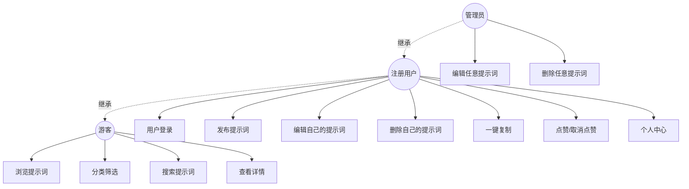
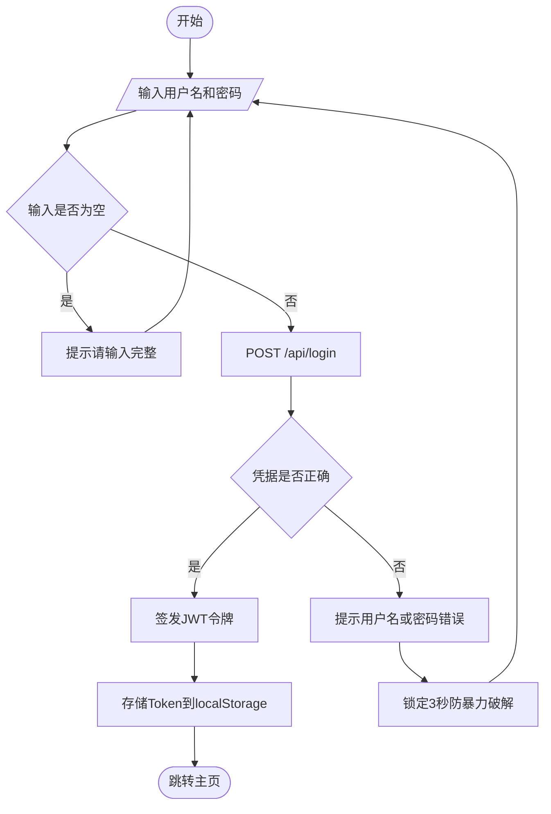
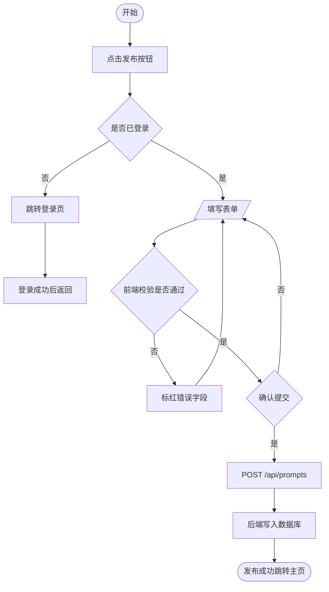
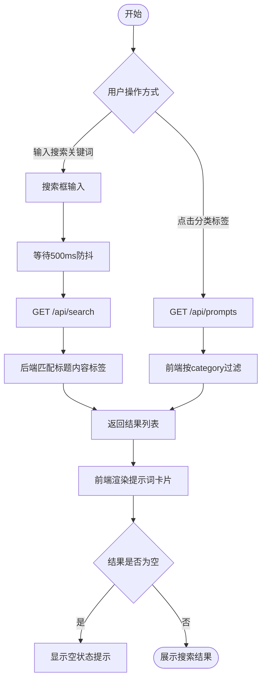
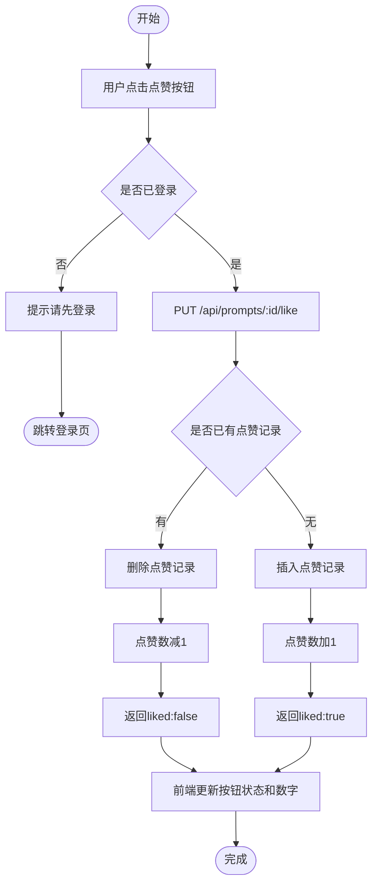
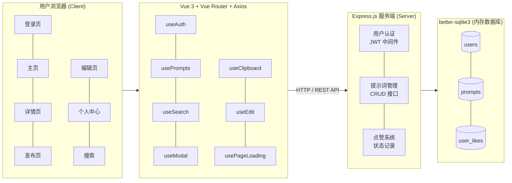
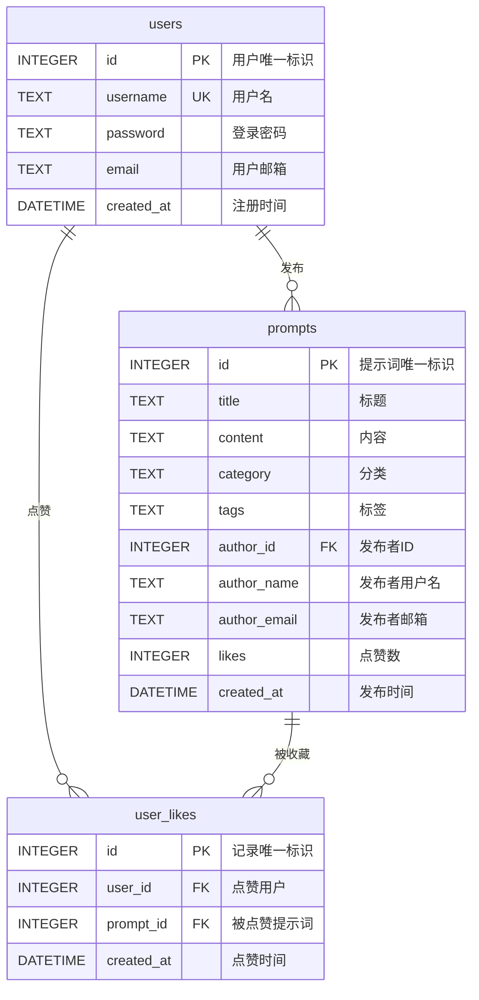

# 天津工业大学

# 软件学院 · 实习报告

# 基于Vue3的PromptCraft - AI 提示词工场安全开发

---

**课程：** 安全程序设计实习

**班级：** 网安2401+网安2401

**学号：** 2411320121+2411320120

**姓名：** 闫浩男+贾天睿

**成绩：**

---

# 一、项目背景与目标

## 1.1 项目背景

随着人工智能技术的飞速发展，尤其是以 ChatGPT、Midjourney 为代表的生成式大模型广泛应用，人类社会正加速迈入智能化时代。如今，AI 工具已经深度融入各行各业以及人们的日常生活中。在这个背景下，AI 模型的输出质量高度依赖于用户输入的指令——即"提示词（Prompt）"。对普通大众而言，如何与 AI 高效沟通、编写出能激发其潜能的高质量提示词，已成为具有一定门槛的新型技能。优秀的提示词能极大提升生产力，但由于经验不足，许多普通用户难以构建有效的提示词，导致 AI 工具的效能大打折扣。基于这一痛点，搭建一个便捷的 AI 提示词共享社区平台显得尤为重要。

在平台的技术选型上，当前 B/S（Browser/Server）架构已成为现代应用开发的主流。Web 应用具备跨平台访问、免安装客户端、易于统一维护和迭代等显著优势。因此，将该共享社区打造为一款前后端分离的 Web 应用，不仅顺应了主流技术发展趋势，更能为用户提供流畅便捷的交互体验。

然而，Web 应用在丰富数字生活的同时，也面临着日益严峻的网络安全威胁。近年来，平台数据泄露、用户隐私被窃取、网页遭恶意篡改等安全事件频发。结合本次"安全程序设计实习"的课程宗旨，开发实践不能仅仅停留在业务逻辑的实现上，更必须将安全防护理念贯彻于软件开发的整个生命周期，真正做到"安全左移"。

综上所述，"基于 Vue3 的 PromptCraft - AI 提示词工场安全开发"项目应运而生。本项目利用现代前端框架 Vue3 与后端 Node.js 运行环境，搭建了一个包含用户认证、提示词发布、分类检索与互动点赞的完整 Web 平台。在解决"AI 提示词编写难"这一业务痛点的同时，系统重点构建了严密的安全防御体系：通过 JWT 机制保障身份认证安全，采用参数化查询彻底阻断 SQL 注入，通过严格的后端属主校验防止水平越权操作，并辅以敏感数据前台脱敏与登录防爆破策略。

## 1.2 项目目标

**功能目标：**
- 熟悉并掌握前后端分离开发流程
- 搭建一个完整的 Web 应用，实现提示词发布、搜索、分类筛选、详情查看及点赞等核心功能
- 理解并实践 Vue 组件化开发思想
- 实践 Node.js 服务器接口开发与数据库交互

**技术目标：**
- 掌握 Vue 3 框架及响应式编程
- 掌握 Node.js (Express.js) 服务端开发
- 掌握 SQLite3 数据库设计与操作

**安全目标：**
- 实现基于 JWT 的身份认证
- 实现细粒度的权限控制与越权防护
- 保障数据安全，包括数据脱敏、防 XSS、防 SQL 注入及防暴力破解

---

# 二、功能需求分析

## 2.1 功能需求分析

### 2.1.1 用户角色分析

本系统涉及三类用户角色：

| 角色 | 说明 | 权限 |
|------|------|------|
| 游客 | 未登录的访问者 | 浏览提示词、搜索、查看详情 |
| 注册用户 | 已登录的普通用户 | 游客全部权限 + 发布、编辑、删除自己的提示词、点赞、个人中心 |
| 管理员 | 系统管理员（admin） | 注册用户全部权限 + 编辑、删除任意用户的提示词 |

### 2.1.2 功能需求列表

| 编号 | 功能模块 | 功能描述 | 优先级 |
|------|---------|---------|--------|
| F01 | 用户登录 | 用户通过用户名和密码登录系统，获取 JWT 令牌 | 高 |
| F02 | 浏览提示词 | 在主页查看所有已发布的提示词卡片列表 | 高 |
| F03 | 分类筛选 | 按分类（写作/编程/绘画/翻译/其他）筛选提示词 | 中 |
| F04 | 搜索提示词 | 通过关键词搜索提示词标题、内容、标签 | 高 |
| F05 | 搜索联想 | 输入关键词时实时显示匹配的提示词标题 | 低 |
| F06 | 查看详情 | 查看提示词完整内容、作者信息、点赞数 | 高 |
| F07 | 一键复制 | 复制提示词内容到剪贴板 | 中 |
| F08 | 发布提示词 | 填写标题、内容、分类、标签，提交发布新提示词 | 高 |
| F09 | 编辑提示词 | 修改自己已发布的提示词内容（管理员可编辑任意提示词） | 中 |
| F10 | 删除提示词 | 删除自己已发布的提示词（管理员可删除任意提示词） | 中 |
| F11 | 点赞/取消点赞 | 对提示词进行点赞或取消点赞操作 | 中 |
| F12 | 个人中心 | 查看"我发布的"和"我喜欢的"提示词列表 | 中 |
| F13 | 数据脱敏 | 用户邮箱部分隐藏显示 | 低 |

## 2.2 非功能需求

| 维度 | 要求 |
|------|------|
| 性能 | 页面加载时间 < 2 秒，搜索响应 < 500ms |
| 安全性 | 防 XSS、防 SQL 注入、防越权、防暴力破解 |
| 可维护性 | 组件化开发，Composables 模块化复用 |
| 兼容性 | 支持 Chrome、Edge、Firefox 等主流浏览器 |
| 可用性 | 界面简洁直观，操作流程清晰 |

## 2.3 用例图



**图2-1 系统用例图**

## 2.4 业务流程图

### 2.4.1 用户登录流程



**图2-2 用户登录流程图**

### 2.4.2 提示词发布流程



**图2-3 提示词发布流程图**

### 2.4.3 搜索与筛选流程



**图2-4 搜索与筛选流程图**

### 2.4.4 点赞流程



**图2-5 点赞流程图**

---

# 三、系统架构设计

## 3.1 架构图设计

PromptCraft 采用前后端分离的 B/S 架构，总体模块图如下：



**图3-1 系统架构图**

**前端模块：**

| 模块 | 功能说明 |
|------|---------|
| 登录页 | 用户名密码登录，JWT Token 认证 |
| 主页 | 提示词卡片列表、分类筛选、搜索联想 |
| 详情页 | 提示词完整内容、一键复制、点赞、编辑/删除 |
| 发布页 | 表单提交新提示词，实时校验 |
| 编辑页 | 修改已有提示词内容 |
| 个人中心 | 我的提示词、邮箱脱敏显示/隐藏 |

**后端模块：**

| 模块 | 功能说明 |
|------|---------|
| 用户认证 | JWT 令牌签发与验证、登录接口 |
| 提示词管理 | CRUD 接口、搜索（含 SQL 注入演示） |
| 点赞系统 | 点赞/取消点赞、状态查询 |

## 3.2 数据库设计

本系统共设计 3 张数据表，如下所示：

**表3-1 users表**

| 字段 | 数据类型 | 是否为主键 | 备注 |
|------|---------|-----------|------|
| id | INTEGER | 是，自增 | 用户的唯一标识 |
| username | TEXT | 否，唯一 | 用户名 |
| password | TEXT | 否 | 用户密码 |
| email | TEXT | 否 | 用户邮箱 |
| created_at | DATETIME | 否 | 注册时间，默认当前时间 |

**表3-2 prompts表**

| 字段 | 数据类型 | 是否为主键 | 备注 |
|------|---------|-----------|------|
| id | INTEGER | 是，自增 | 提示词的唯一标识 |
| title | TEXT | 否 | 提示词标题 |
| content | TEXT | 否 | 提示词内容 |
| category | TEXT | 否 | 分类（写作/编程/绘画/翻译/其他） |
| tags | TEXT | 否 | 标签，逗号分隔 |
| author_id | INTEGER | 否 | 关联users表id，外键 |
| author_name | TEXT | 否 | 作者用户名（冗余存储） |
| author_email | TEXT | 否 | 作者邮箱（冗余存储） |
| likes | INTEGER | 否 | 点赞数，默认0 |
| created_at | DATETIME | 否 | 发布时间，默认当前时间 |

**表3-3 user_likes表**

| 字段 | 数据类型 | 是否为主键 | 备注 |
|------|---------|-----------|------|
| id | INTEGER | 是，自增 | 点赞记录的唯一标识 |
| user_id | INTEGER | 否 | 关联users表id，外键 |
| prompt_id | INTEGER | 否 | 关联prompts表id，外键 |
| created_at | DATETIME | 否 | 点赞时间，默认当前时间 |

> 注：user_id 和 prompt_id 设有 UNIQUE 联合约束，防止重复点赞。

## 3.3 E-R 图设计



**图3-2 E-R图**

**关系说明：**

| 关系 | 实体A | 实体B | 基数 | 说明 |
|------|-------|-------|------|------|
| 发布 | users | prompts | 1:N | 一个用户可发布多条提示词，每条提示词属于一个用户 |
| 点赞 | users | prompts | M:N | 一个用户可点赞多条提示词，一条提示词可被多个用户点赞，通过 user_likes 关联表实现 |

## 3.4 API 接口设计

| 方法 | 路径 | 说明 | 认证 |
|------|------|------|------|
| POST | /api/login | 用户登录 | 否 |
| GET | /api/prompts | 获取所有提示词 | 否 |
| GET | /api/prompts/:id | 获取单个提示词 | 否 |
| GET | /api/prompts/mine | 获取我的提示词 | JWT |
| GET | /api/prompts/liked | 获取我点赞的提示词 | JWT |
| POST | /api/prompts | 发布新提示词 | JWT |
| PUT | /api/prompts/:id | 编辑提示词 | JWT |
| DELETE | /api/prompts/:id | 删除提示词 | JWT |
| PUT | /api/prompts/:id/like | 点赞/取消点赞 | JWT |
| GET | /api/prompts/:id/like-status | 获取点赞状态 | JWT |
| GET | /api/search?q=xxx | 搜索提示词 | 否 |
| GET | /api/suggestions?q=xxx | 搜索联想 | 否 |

## 3.5 技术选型

| 层级 | 技术 | 选型理由 |
|------|------|---------|
| 前端框架 | Vue 3 | 渐进式框架，Composition API 提供更好的逻辑复用 |
| 构建工具 | Vite 8 | 基于 ESM 的极速冷启动，HMR 热更新毫秒级响应 |
| 路由 | Vue Router 4 | Vue 官方路由，原生支持 History 模式、路由守卫 |
| HTTP 客户端 | Axios | 支持请求/拦截器、自动 JSON 转换 |
| 后端框架 | Express 5 | Node.js 最成熟的 Web 框架，中间件机制灵活 |
| 数据库 | better-sqlite3 | 同步 API，零配置嵌入式数据库，适合课程演示 |
| 认证 | JWT (jsonwebtoken) | 无状态令牌，前后端分离友好 |
| 部署 | Render.com | 免费额度充足，支持 GitHub 自动部署 |

---

# 四、系统实现

## 4.1 前端实现

### 4.1.1 用户登录模块

用户输入用户名和密码，前端通过 Axios 发送 POST 请求到 `/api/login`，后端验证凭据后签发 JWT 令牌，前端将 Token 存储到 localStorage，后续请求自动附加到 Authorization 头。

```javascript
const login = async (username, password) => {
  try {
    const res = await axios.post(`${API_BASE}/api/login`, { username, password })
    if (res.data.success) {
      localStorage.setItem('token', res.data.token)
      localStorage.setItem('user', JSON.stringify(res.data.user))
      currentUser.value = res.data.user
      return true
    }
    return false
  } catch (err) { return false }
}
```

### 4.1.2 提示词列表与搜索模块

主页展示所有提示词卡片网格布局，支持分类筛选（写作/编程/绘画/翻译/其他）、关键词搜索（含 500ms 防抖）、搜索联想下拉。侧边栏提供分类导航和"我发布的""我喜欢的"个人筛选。

```javascript
const searchPrompts = async (keyword) => {
  const res = await axios.get(`${API_BASE}/api/search?q=${encodeURIComponent(keyword)}`)
  promptList.value = res.data
}

const getSuggestions = async (keyword) => {
  const res = await axios.get(`${API_BASE}/api/suggestions?q=${encodeURIComponent(keyword)}`)
  return res.data
}
```

### 4.1.3 搜索与联想模块

搜索框输入时通过 watch 监听，300ms 防抖后触发搜索请求和联想查询。选择联想项时清空搜索框并跳转详情页，通过 `isSelecting` 标志防止 watch 重复触发。

```javascript
watch(searchText, (newValue) => {
  if (isSelecting) return
  clearTimeout(searchTimer)
  searchTimer = setTimeout(async () => {
    if (newValue.trim()) {
      activeCategory.value = '全部'
      await searchPrompts(newValue)
      suggestions.value = await getSuggestions(newValue)
      showSuggestions.value = suggestions.value.length > 0
    } else {
      await fetchPrompts()
      suggestions.value = []
    }
  }, 300)
})
```

### 4.1.4 通用弹窗模块

使用 Promise 封装 alert/confirm 弹窗，调用 `await showConfirm('确定删除？')` 即可等待用户操作，解决原生 `confirm()` 阻塞且不可定制的问题。弹窗支持 success/error/warning/info 四种图标。

```javascript
const showConfirm = (message, title = '确认', icon = 'warning') => {
  return new Promise((resolve) => {
    modal.value = { visible: true, type: 'confirm', title, message, icon, resolve }
  })
}
const handleModalOk = () => {
  if (modal.value.resolve) modal.value.resolve(true)
  modal.value.visible = false
}
```

### 4.1.5 提示词详情模块

详情页展示提示词完整内容、分类标签、作者信息（邮箱脱敏）、发布时间。提供一键复制、点赞、编辑和删除按钮。编辑和删除仅对作者和管理员可见，实现前端权限控制。

```html
<button v-if="currentUser && (currentUser.id === currentPrompt.author_id || currentUser.username === 'admin')"
  @click="onStartEdit(currentPrompt)">编辑</button>
<button v-if="currentUser && (currentUser.id === currentPrompt.author_id || currentUser.username === 'admin')"
  @click="onDelete(currentPrompt.id)">删除</button>
```

### 4.1.6 提示词发布模块

发布页提供表单填写标题、选择分类、输入内容和标签。前端实时校验：标题至少 3 字符、内容至少 10 字符，不满足时输入框标红提示。提交时附带 JWT 令牌，后端校验登录状态。

```javascript
const createPrompt = async (promptData) => {
  isLoading.value = true
  try {
    await axios.post(`${API_BASE}/api/prompts`, promptData, { headers: getAuthHeaders() })
    await fetchPrompts()
    return true
  } catch (err) { return false }
  finally { isLoading.value = false }
}
```

### 4.1.7 提示词编辑模块

编辑页复用发布页表单结构，进入时自动填充原数据。提交前弹出确认对话框，保存成功后刷新列表并跳转主页。由 useEdit composable 管理编辑状态。

```javascript
const onSaveEdit = async (navigateTo) => {
  if (!editForm.value.title.trim() || !editForm.value.content.trim()) {
    await showAlert('请填写完整信息', '提示', 'warning')
    return false
  }
  const confirmed = await showConfirm('确定保存修改吗？')
  if (!confirmed) return false
  const success = await updatePrompt(editPrompt.value.id, editForm.value)
  if (success) {
    await showAlert('更新成功！', '成功', 'success')
    editPrompt.value = null
    navigateTo('/')
    await fetchPrompts()
  }
}
```

### 4.1.8 一键复制模块

点击"一键复制"按钮，内容自动复制到剪贴板，鼠标位置弹出浮动气泡提示"已复制到剪贴板！"，1.5 秒后消失。优先使用 `navigator.clipboard` API，不支持时降级为 `execCommand('copy')`。

```javascript
const copyToClipboard = async (text, event) => {
  let success = false
  try { await navigator.clipboard.writeText(text); success = true }
  catch {
    const ta = document.createElement('textarea'); ta.value = text
    document.body.appendChild(ta); ta.select()
    try { success = document.execCommand('copy') } finally { ta.remove() }
  }
  const bubble = showBubble(success ? '已复制到剪贴板！' : '复制失败', !success)
  bubble.show(event); setTimeout(() => bubble.hide(), 1500)
}
```

### 4.1.9 删除模块

点击删除按钮后弹出确认对话框，确认后调用 DELETE 接口，成功后自动刷新列表。后端校验操作者是否为作者或管理员，防止水平越权。

```javascript
const deletePrompt = async (id) => {
  isLoading.value = true
  try {
    await axios.delete(`${API_BASE}/api/prompts/${id}`, { headers: getAuthHeaders() })
    await fetchPrompts()
    return true
  } catch (err) { return false }
  finally { isLoading.value = false }
}
```

### 4.1.10 个人中心模块

个人中心页展示当前用户账号信息（用户名、邮箱可切换显示/脱敏、发布数量）及"我的提示词"列表。通过 GET `/api/prompts/mine` 接口获取当前用户发布的提示词。

```javascript
const fetchMyPrompts = async () => {
  isLoading.value = true
  try {
    const res = await axios.get(`${API_BASE}/api/prompts/mine`, { headers: getAuthHeaders() })
    promptList.value = res.data
  } catch (err) { console.error('获取我的提示词失败:', err) }
  finally { isLoading.value = false }
}
```

### 4.1.11 点赞模块

用户可对提示词点赞或取消点赞，前端实时更新点赞数和按钮状态，通过 user_likes 联合唯一约束防止重复点赞。

```javascript
const likePrompt = async (id) => {
  const res = await axios.put(`${API_BASE}/api/prompts/${id}/like`, null, { headers: getAuthHeaders() })
  const idx = promptList.value.findIndex(p => p.id === id)
  if (idx !== -1) {
    const updated = { ...promptList.value[idx] }
    updated.likes += res.data.liked ? 1 : -1
    promptList.value[idx] = updated
  }
  return res.data.liked
}
```

### 4.1.12 深色/浅色主题切换

全站支持深色与浅色两套主题，通过导航栏月亮/太阳图标切换。切换时从按钮位置以圆形扩散动画覆盖全屏（Web Animations API + clip-path），采用 ease-in 缓动加速扩散。主题偏好持久化到 localStorage，自动检测系统 `prefers-color-scheme`。所有组件通过 CSS 变量引用颜色，杜绝硬编码。

```javascript
const toggleThemeWithAnimation = (event) => {
  const { left, top, width, height } = event.currentTarget.getBoundingClientRect()
  const cx = left + width / 2, cy = top + height / 2
  const maxR = Math.hypot(Math.max(cx, innerWidth - cx), Math.max(cy, innerHeight - cy))
  const overlay = document.createElement('div')
  overlay.style.cssText = `position:fixed;inset:0;z-index:99999;pointer-events:none;
    background:${theme.value === 'light' ? '#1a1a1a' : '#f5f5f5'};clip-path:circle(0px at ${cx}px ${cy}px)`
  document.body.appendChild(overlay)
  const anim = overlay.animate([
    { clipPath: `circle(0px at ${cx}px ${cy}px)`, easing: 'ease-in' },
    { clipPath: `circle(${maxR * 0.6}px at ${cx}px ${cy}px)`, easing: 'ease-in' },
    { clipPath: `circle(${maxR}px at ${cx}px ${cy}px)` }
  ], { duration: 450, fill: 'forwards' })
  setTimeout(() => toggleTheme(), 200)
  anim.onfinish = () => overlay.animate([{ opacity: 1 }, { opacity: 0 }], { duration: 300 }).onfinish = () => overlay.remove()
}
```

## 4.2 后端实现

### 4.2.1 路由与中间件配置

Express 服务器配置 JSON 解析、CORS 跨域支持。JWT 认证中间件从 Authorization 头提取令牌，验证签名和有效期，通过后将用户信息挂载到 `req.user`。

```javascript
app.use(express.json())
app.use(cors())

const authenticateToken = (req, res, next) => {
  const token = req.headers['authorization']?.split(' ')[1]
  if (!token) return res.status(401).json({ error: '未提供认证令牌' })
  jwt.verify(token, JWT_SECRET, (err, user) => {
    if (err) return res.status(403).json({ error: '令牌无效或已过期' })
    req.user = user
    next()
  })
}
```

服务器同时托管 Vite 构建产物，实现前后端同源部署，SPA 通配路由回退到 index.html：

```javascript
app.use(express.static(path.join(__dirname, '../dist')))
app.get('/*path', (req, res) => {
  res.sendFile(path.join(__dirname, '../dist/index.html'))
})
```

### 4.2.2 数据库操作封装

使用 better-sqlite3 预编译语句，所有查询均使用 `?` 占位符，杜绝 SQL 注入。建表时设置外键约束和联合唯一约束。

```javascript
const db = new Database(':memory:')
db.exec(`CREATE TABLE users (
  id INTEGER PRIMARY KEY AUTOINCREMENT,
  username TEXT UNIQUE, password TEXT, email TEXT,
  created_at DATETIME DEFAULT CURRENT_TIMESTAMP
)`)
// ... prompts、user_likes 表同理

const stmts = {
  findUser: db.prepare(`SELECT * FROM users WHERE username = ? AND password = ?`),
  getAllPrompts: db.prepare(`SELECT * FROM prompts ORDER BY created_at DESC`),
  insertPrompt: db.prepare(`INSERT INTO prompts (...) VALUES (?, ?, ?, ?, ?, ?, ?)`),
  findLike: db.prepare(`SELECT id FROM user_likes WHERE user_id = ? AND prompt_id = ?`),
  // ... 共 15 个预编译语句
}
```

### 4.2.3 接口设计

共 12 个 RESTful API，按功能分为四类：

**认证接口：**

| 方法 | 路径 | 说明 | 认证 |
|------|------|------|------|
| POST | /api/login | 用户登录，签发 JWT（24h 有效期） | 否 |

**提示词 CRUD 接口：**

| 方法 | 路径 | 说明 | 认证 |
|------|------|------|------|
| GET | /api/prompts | 获取全部提示词（按时间倒序） | 否 |
| GET | /api/prompts/:id | 获取单个提示词详情 | 否 |
| GET | /api/prompts/mine | 获取当前用户发布的提示词 | JWT |
| GET | /api/prompts/liked | 获取当前用户点赞的提示词 | JWT |
| POST | /api/prompts | 发布新提示词 | JWT |
| PUT | /api/prompts/:id | 编辑提示词（含属主校验） | JWT |
| DELETE | /api/prompts/:id | 删除提示词（含属主校验） | JWT |

**互动接口：**

| 方法 | 路径 | 说明 | 认证 |
|------|------|------|------|
| PUT | /api/prompts/:id/like | 点赞/取消点赞切换 | JWT |
| GET | /api/prompts/:id/like-status | 查询当前用户点赞状态 | JWT |

**搜索接口：**

| 方法 | 路径 | 说明 | 认证 |
|------|------|------|------|
| GET | /api/search?q=xxx | 全文搜索（标题/内容/标签） | 否 |
| GET | /api/suggestions?q=xxx | 搜索联想（返回标题+id，限5条） | 否 |

所有接口统一返回 JSON 格式，错误时返回 `{ error: "..." }` 并设置对应 HTTP 状态码。

### 4.2.4 安全加固

**SQL 注入防护与漏洞演示：** 搜索接口故意使用字符串拼接构造 SQL，输入 `' OR '1'='1` 可返回全部数据，供课堂攻防对比。其余接口均使用预编译语句 `?` 占位符，用户输入被当作纯文本，彻底阻断注入。

```javascript
// 漏洞版（仅搜索接口，供演示）
const sql = `SELECT * FROM prompts WHERE title LIKE '%${q}%'`
db.prepare(sql).all()
// 输入 ' OR '1'='1 拼接后变成：
// SELECT * FROM prompts WHERE title LIKE '%' OR '1'='1%'
// 条件恒真，返回全部数据

// 安全版（其余所有接口均使用预编译语句）
stmts.getAllPrompts.all()                          // GET /api/prompts
stmts.getPromptById.get(req.params.id)             // GET /api/prompts/:id
stmts.getPromptsByAuthor.all(req.user.id)          // GET /api/prompts/mine
stmts.getLikedPrompts.all(req.user.id)             // GET /api/prompts/liked
stmts.insertPrompt.run(title, content, ...)        // POST /api/prompts
stmts.updatePrompt.run(title, content, ..., id)    // PUT /api/prompts/:id
stmts.deletePrompt.run(id)                         // DELETE /api/prompts/:id
stmts.findLike.get(req.user.id, req.params.id)    // PUT /api/prompts/:id/like
stmts.getSuggestions.all(`%${q}%`)                 // GET /api/suggestions
```

**邮箱脱敏：** API 返回提示词数据时，对 author_email 字段做正则脱敏处理：

```javascript
const hideEmail = (email) => {
  if (!email) return '';
  return email.replace(/(.{2})(.*)(@.*)/, '$1***$3');
};
const maskPrompt = (p) => {
  if (!p) return p;
  return { ...p, author_email: hideEmail(p.author_email) };
};
```

**水平越权防护：** 编辑和删除接口后端校验 author_id，非作者无权操作：

```javascript
app.put('/api/prompts/:id', authenticateToken, (req, res) => {
  const row = stmts.getPromptById.get(req.params.id);
  if (row.author_id !== req.user.id && req.user.username !== 'admin') {
    return res.status(403).json({ error: '无权编辑此提示词' });
  }
  stmts.updatePrompt.run(title, content, category, tags, req.params.id);
});
```

## 4.3 安全实现

### 4.3.1 用户身份认证与权限管理

**JWT 认证流程：** 用户登录成功后，服务端签发 JWT 令牌（有效期 24 小时），令牌中包含用户 id、username、email（已脱敏）。前端将 Token 存储到 localStorage，后续每次请求通过 `Authorization: Bearer` 头传递，JWT 中间件验证签名和有效期后将用户信息挂载到 `req.user`。

**界面表现：** 登录页（LoginPage）输入用户名密码后跳转主页；未登录用户访问发布页、个人中心等受保护路由时，Vue Router 路由守卫自动重定向到登录页；登录失败后按钮锁定 3 秒并显示错误提示，防止暴力破解。

**水平越权防护：** 编辑和删除接口后端校验 `author_id`，仅作者和管理员可操作。前端详情页（DetailPage）同样通过 `v-if` 控制编辑/删除按钮的可见性，实现前后端双重防护。

**核心代码 1 — JWT 中间件与越权校验：**

```javascript
const authenticateToken = (req, res, next) => {
  const token = req.headers['authorization']?.split(' ')[1]
  if (!token) return res.status(401).json({ error: '未提供认证令牌' })
  jwt.verify(token, JWT_SECRET, (err, user) => {
    if (err) return res.status(403).json({ error: '令牌无效或已过期' })
    req.user = user; next()
  })
}

app.put('/api/prompts/:id', authenticateToken, (req, res) => {
  const row = stmts.getPromptById.get(req.params.id)
  if (row.author_id !== req.user.id && req.user.username !== 'admin')
    return res.status(403).json({ error: '无权编辑此提示词' })
  stmts.updatePrompt.run(title, content, category, tags, req.params.id)
})
```

### 4.3.2 防止常见攻击

**XSS 防护：** 前端全局使用 Vue 的 `{{ }}` 插值表达式展示用户内容，禁用 `v-html`。Vue 插值会自动将 `<script>` 转义为 `&lt;script&gt;`，使恶意脚本失效。在搜索框输入 `<script>alert(1)</script>` 仅显示为文本，不会执行。

**SQL 注入防护：** 后端使用 better-sqlite3 预编译语句（`?` 占位符），用户输入被当作纯文本处理，彻底阻断注入。搜索接口故意保留字符串拼接漏洞版本，输入 `' OR '1'='1` 可返回全部数据，供课堂攻防对比。

**防暴力破解：** 前端登录失败后锁定 3 秒禁用按钮，作为 UX 层面的防护。但纯前端限制可被绕过（直接调用 API），因此后端同步实现了基于 IP 的速率限制：同一 IP 5 分钟内登录失败超过 5 次，返回 429 状态码拒绝请求。

**数据脱敏：** 用户邮箱通过正则脱敏：`admin@promptcraft.com` → `ad***@promptcraft.com`，API 返回数据时统一处理，前端详情页和主页均显示脱敏后的邮箱。

**核心代码 2 — 邮箱脱敏：**

```javascript
const hideEmail = (email) => {
  if (!email) return ''
  return email.replace(/(.{2})(.*)(@.*)/, '$1***$3')
}
const maskPrompt = (p) => ({ ...p, author_email: hideEmail(p.author_email) })
const maskPrompts = (list) => list.map(maskPrompt)
```

**核心代码 3 — 后端登录限流：**

```javascript
const loginAttempts = new Map()
const MAX_ATTEMPTS = 5, WINDOW_MS = 5 * 60 * 1000

app.post('/api/login', (req, res) => {
  const ip = req.ip
  const record = loginAttempts.get(ip) || { count: 0, firstAt: Date.now() }
  if (Date.now() - record.firstAt > WINDOW_MS) { record.count = 0; record.firstAt = Date.now() }
  if (record.count >= MAX_ATTEMPTS) return res.status(429).json({ error: '尝试次数过多，请5分钟后重试' })

  const { username, password } = req.body
  const row = stmts.findUser.get(username, password)
  if (!row) { record.count++; loginAttempts.set(ip, record); return res.json({ success: false }) }
  loginAttempts.delete(ip)
  const token = jwt.sign({ id: row.id, username: row.username }, JWT_SECRET, { expiresIn: '24h' })
  res.json({ success: true, user: { id: row.id, username: row.username }, token })
})
```

---

# 五、系统测试

## 5.1 功能测试

| 编号 | 功能项 | 测试方法 | 预期结果 | 实际结果 |
|------|-------|---------|---------|---------|
| T01 | 用户登录 | 输入正确的用户名和密码 | 登录成功，跳转主页 | 符合预期 |
| T02 | 登录失败 | 输入错误密码 | 提示"用户名或密码错误"，锁定3秒 | 符合预期 |
| T03 | 浏览提示词 | 访问主页 | 显示所有提示词卡片列表 | 符合预期 |
| T04 | 分类筛选 | 点击"编程"分类 | 仅显示编程类提示词 | 符合预期 |
| T05 | 搜索提示词 | 搜索框输入"写作" | 显示匹配的提示词 | 符合预期 |
| T06 | 查看详情 | 点击提示词卡片 | 显示完整内容、作者、点赞数 | 符合预期 |
| T07 | 一键复制 | 点击复制按钮 | 内容复制到剪贴板，显示提示气泡 | 符合预期 |
| T08 | 发布提示词 | 填写表单并提交 | 提示词发布成功，列表刷新 | 符合预期 |
| T09 | 编辑提示词 | 修改已发布的提示词 | 更新成功 | 符合预期 |
| T10 | 删除提示词 | 删除自己的提示词 | 删除成功，列表刷新 | 符合预期 |
| T11 | 点赞 | 点击点赞按钮 | 点赞数+1，按钮变红 | 符合预期 |
| T12 | 取消点赞 | 再次点击点赞按钮 | 点赞数-1，按钮恢复 | 符合预期 |
| T13 | 个人中心 | 查看"我发布的" | 仅显示当前用户的提示词 | 符合预期 |
| T14 | 邮箱脱敏 | 查看提示词作者信息 | 邮箱显示为 a***@promptcraft.com | 符合预期 |

## 5.2 安全测试

| 编号 | 测试项 | 测试方法 | 预期结果 | 实际结果 |
|------|-------|---------|---------|---------|
| S01 | 未登录访问受保护页面 | 直接访问 /create | 跳转到登录页 | 符合预期 |
| S02 | JWT 伪造 | 使用篡改的 Token 请求 | 返回 403 令牌无效 | 符合预期 |
| S03 | 水平越权（编辑） | 用 user1 的 Token 编辑 admin 的提示词 | 返回 403 无权编辑 | 符合预期 |
| S04 | 水平越权（删除） | 用 user1 的 Token 删除 admin 的提示词 | 返回 403 无权删除 | 符合预期 |
| S05 | XSS 攻击 | 在标题输入 `<script>alert(1)</script>` | 页面不执行脚本，显示为文本 | 符合预期 |
| S06 | SQL 注入（漏洞版） | 搜索框输入 `' OR '1'='1` | 返回全部数据（漏洞演示） | 符合预期 |
| S07 | SQL 注入（修复版） | 使用参数化查询后同样输入 | 无匹配结果 | 符合预期 |
| S08 | 邮箱泄露 | 调用 GET /api/prompts 查看返回数据 | author_email 已脱敏 | 符合预期 |

---

# 六、项目总结与反思

## （1）技术收获

通过本次 PromptCraft 提示词分享平台项目的设计与开发，系统学习并实践了前后端分离 Web 应用的完整开发流程，对现代 Web 开发架构有了较全面的理解。

前端部分，学习并使用了 Vue 3 + Composition API 完成页面组件开发，掌握了组件拆分、状态管理、路由跳转、响应式数据以及页面交互设计；通过 Vue Router 实现页面导航与权限控制；使用 Axios 完成前后端数据通信。

后端部分，学习使用 Express.js 搭建 RESTful API 服务，理解了接口设计、请求处理、中间件机制以及业务逻辑组织方式；使用 JWT（JSON Web Token）完成用户身份认证，实现登录状态管理。

数据库部分，使用 better-sqlite3 构建轻量级数据存储，完成用户、提示词以及点赞记录等数据表设计，并学习了主键、外键、一对多、多对多关系建模方法。

同时，在项目开发过程中进一步理解了 Web 安全相关知识，包括参数校验、权限控制、SQL 注入防护、数据脱敏以及前后端职责划分。

## （2）遇到的问题

① 前后端数据联调困难：前期接口返回数据格式不统一，导致页面无法正常渲染。

② 登录认证状态维护复杂：JWT 登录后页面刷新出现登录状态丢失问题。

③ 点赞功能逻辑容易重复提交：用户快速点击时可能出现重复点赞或点赞数量异常。

④ 搜索功能性能问题：输入内容时频繁发送请求，影响页面响应速度。

⑤ 数据库关系设计不够合理：初期未设计中间表，导致用户与提示词点赞关系无法正确表达。

## （3）解决方案

① 统一接口返回格式，规范 API 数据结构，并增加异常处理逻辑。

② 使用浏览器 LocalStorage 保存 JWT Token，并通过路由守卫进行登录状态校验。

③ 新增 user_likes 关联表，并设置联合唯一约束（user_id, prompt_id），防止重复点赞。

④ 搜索功能采用防抖（Debounce）机制，减少短时间内重复请求，提高系统性能。

⑤ 重新设计数据库 E-R 模型，将用户、提示词、点赞关系进行规范化建模。

## （4）后续改进

① 完善用户体系：增加注册、找回密码、头像上传等功能。

② 优化数据库方案：将 SQLite 升级为 MySQL，提高并发能力和数据持久化能力。

③ 增加推荐能力：根据用户浏览和点赞记录实现个性化提示词推荐。

④ 强化系统安全性：增加密码加密存储（bcrypt）、接口限流、日志审计。

⑤ 优化用户体验：支持移动端适配、~~深色模式~~（已完成）、分页加载等功能。

---

# 参考文献

[1] 尤雨溪. Vue.js 3 官方文档[EB/OL]. https://vuejs.org/, 2024.

[2] Express.js 官方文档[EB/OL]. https://expressjs.com/, 2024.

[3] JSON Web Token 官方文档[EB/OL]. https://jwt.io/, 2024.

[4] better-sqlite3 GitHub 仓库[EB/OL]. https://github.com/WiseLibs/better-sqlite3, 2024.

[5] OWASP. OWASP Top Ten Web Application Security Risks[EB/OL]. https://owasp.org/www-project-top-ten/, 2021.

[6] Render.com 官方文档[EB/OL]. https://render.com/docs, 2024.
